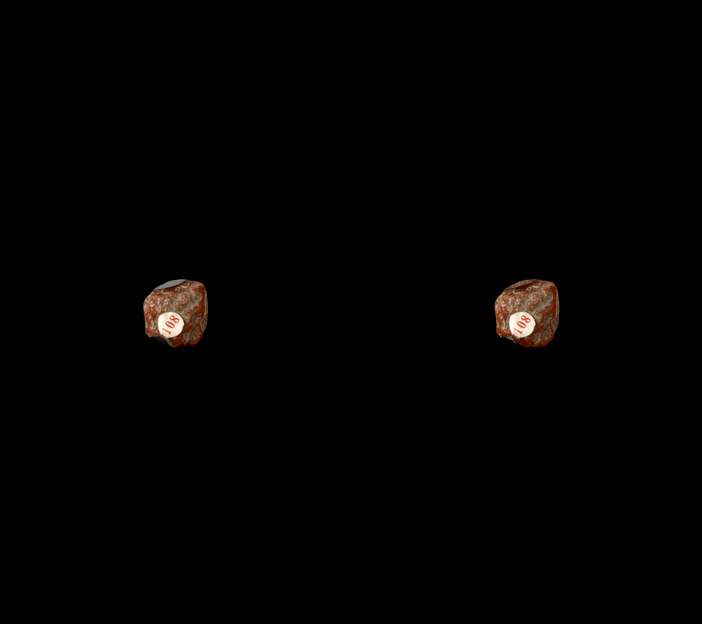

# Rendered GIF Gallery

This repository collects rendered GIF previews.

## Gallery

| Name | Preview |
| --- | --- |
| `baiheyu` |  |
| `baishuijing` |  |
| `chitiekuang` |  |
| `dianqishi` |  |
| `donglingyu` |  |
| `erzhuangchitiekuang` |  |
| `fangzhushi` |  |
| `furongshi` |  |
| `gaolingshi` |  |
| `guihuamu` |  |
| `hanbaiyu` |  |
| `heiyaoshi` |  |
| `hongmanao` |  |
| `hupo` |  |
| `jinyunmu` |  |
| `lantongkuang` |  |
| `lvfeishi` |  |
| `maifanshi` |  |
| `meijing` |  |
| `qingjinshi` |  |
| `shigao` |  |
| `shiying` |  |
| `tongniekuang` |  |
| `yanshuijin` |  |
| `zhusha` |  |

## Add More GIFs

1. Upload the `.gif` file to this repository root.
2. Add a row under `Gallery`:

```md
| `short-name` |  |
```

3. Commit and push the change. GitHub will render the GIF directly on the repository homepage.
